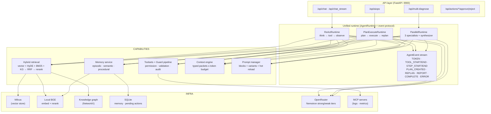

# SuperBizAgent — OnCall AI Agent

[English](README.md) | [简体中文](README.zh-CN.md)

> A production-shaped AIOps assistant built on FastAPI + LangGraph: three agent paradigms on one unified runtime, hybrid RAG with a graceful degradation ladder, long-term memory, structured planning with tool governance, and a three-layer evaluation harness.


## Highlights

- **Unified agent runtime** — ReAct / Plan-Execute / Parallel-specialists all implement the same `AgentRuntime` interface and emit the same 10-type structured event stream; SSE contracts are append-only and golden-snapshot tested.
- **Hybrid retrieval that degrades gracefully** — vector (local BGE) + HyDE + BM25 + knowledge-graph channels fused with N-way RRF, then local cross-encoder rerank; when dependencies fail it walks down a 6-step ladder instead of erroring.
- **Long-term memory** — episodic / semantic / procedural memories in SQLite (WAL, soft delete), embedding-based recall with a weighted scoring formula, and LLM-free episodic→semantic consolidation.
- **Token-budget context engineering** — typed packets (memory / KG / docs / history) with per-kind quotas, spillover redistribution, and weak-LLM roll-up compression under a hard token budget.
- **Structured planning & tool governance** — plans are typed (`PlanStep` / `StructuredPlan`) with a fault-tolerant parser that never raises; every tool call passes through a single guard pipeline (permission → schema validation → execution → audit), and high-risk actions require human approval via an API with exactly-once execution semantics.
- **Prompt engineering as infrastructure** — composable prompt blocks (persona / rules / few-shot) with hot reload, header-driven A/B variants (`X-Prompt-Variant`) attributed per session in the cost tracker, and an A/B regression runner.
- **Three-layer evaluation** — BFCL-style tool-call replay, GAIA-style graded task matching, LLM-as-judge (pairwise win rate + Cohen's κ), plus a component-level regression runner whose gates fail loudly via non-zero exit; user feedback auto-backfills the negative-case dataset.

## Architecture



All state flows through LangGraph checkpointers per session; the API layer translates runtime events into legacy SSE dicts via a golden-snapshot-tested translator, so streaming contracts only ever grow — never break.

### The three paradigms

| Runtime | Pattern | Streaming behavior |
|---|---|---|
| `ReActRuntime` | think → tool call → observe loop (LangGraph `create_agent`) | dual-channel `stream_mode=["messages","updates"]`: tokens as they generate, tool start/end as nodes commit |
| `PlanExecuteRuntime` | plan → execute → replan StateGraph with structured plans | true incremental events under an overall deadline; partial report on timeout |
| `ParallelRuntime` | log/metric/knowledge specialists run concurrently, synthesizer cross-validates | per-agent step events from an async queue; failure isolation per specialist |

### Structured planning that can't crash

The planner emits typed `PlanStep`s (`tool`, `args`, `depends_on`, `expected_evidence`). `parse_plan()` walks a rescue ladder — passthrough → fenced JSON → balanced-brace extraction → truncated-JSON salvage → line-mode fallback — so a malformed LLM response degrades to plain string steps instead of raising. The executor runs bound-tool steps directly through the guard and falls back to a mini-ReAct for unbound ones.

### Tool governance & human confirmation

Every call funnels through `guarded_call`: registry permission check → JSON-schema argument validation → execution → audit trail. High-risk tools never execute directly: the guard proposes a *pending action* (SQLite-backed, TTL'd) and the workflow pauses until someone calls:

```
GET  /api/actions/pending
POST /api/actions/{action_id}/approve   # atomic claim → exactly-once execution
POST /api/actions/{action_id}/reject
```

### Hybrid retrieval & degradation ladder

Four channels — dense vector (LLM-rewritten query), HyDE (hypothetical answer embedding), BM25 (jieba-tokenized), and one-hop knowledge-graph subgraphs — are fused with reciprocal-rank fusion (k=60) and reranked by a local cross-encoder against the original query. Each channel is independently fault-isolated; when health checks fail, retrieval walks down the ladder rather than dying:

```
L0  hybrid 4-channel + rerank      →  L1  no-rerank vector+BM25  →  L2  BM25 (rewritten query)
→  L3  BM25 (raw query)            →  L4  KG-only                 →  template answer
```

Embeddings (`BAAI/bge-large-zh-v1.5`, 1024-d) and the reranker (`BAAI/bge-reranker-base`) run **locally** — zero API cost, fully offline; only query rewriting and HyDE need the remote LLM.

### Long-term memory & context engineering

- Four memory types modeled on cognitive layers; `working` stays in the LangGraph checkpointer, the rest persist to SQLite with WAL mode and soft delete.
- Recall scores candidates by `0.6·cosine + 0.25·importance + 0.15·exp(-λ·age_days)` and returns top-k above an importance floor.
- `consolidate()` merges clustered episodics into semantic memories deterministically — no LLM in the loop.
- The context engine packs memory/KG/docs/history packets under per-kind quotas into a hard token budget, redistributing leftovers and roll-up-compressing overflow while preserving `[PLAN]`/`[结论]`/`[未解]` marker lines.

### Prompts as versioned infrastructure

Templates declare reusable blocks (`prompts/blocks/*.yaml`, intent-tagged few-shots) and named variants; `render_composed()` assembles persona → body → rules → few-shots with mtime-based hot reload. Send `X-Prompt-Variant: concise` to route a request onto a separately compiled agent graph; actual usage is attributed per session in the cost tracker and echoed in the SSE `done` event, ready for pairwise judge comparison.

## Quick start

Requirements: **Python 3.11+**, Docker (for Milvus), an [OpenRouter API key](https://openrouter.ai/settings/keys).

```bash
# 1. Install
make install          # pip install -e .
# or: uv sync --group dev

# 2. Configure
cp .env.example .env  # then set OPENROUTER_API_KEY (the only required var)

# 3. One-click bring-up: Milvus → MCP servers → API → ingest docs
make init

# 4. Verify
make check            # curl http://localhost:9900/health
open http://localhost:9900/docs
```

First index build downloads the ~1.3 GB local BGE model. To rebuild vectors after changing documents or the embedding model:

```bash
make reindex          # re-ingest aiops-docs/
make reindex-drop     # drop + rebuild (required after changing embedding model)
```

Foreground development: `make dev` (uvicorn --reload). Windows: `start-windows.bat`.

### Make targets

| Target | Purpose |
|---|---|
| `make init` | one-click: Milvus up → services → wait healthy → upload docs |
| `make up` / `down` / `status` | Docker compose for Milvus standalone (+Attu, MinIO) |
| `make start` / `stop` / `restart` | background MCP servers (:8003 logs, :8004 metrics) + FastAPI (:9900) |
| `make dev` / `run` | foreground uvicorn (with / without reload) |
| `make upload` / `list-docs` | POST `aiops-docs/*.md` into the index / list indexed files |
| `make reindex` / `reindex-drop` | rebuild vector collection (+ sanity search) |
| `make test` / `test-quick` / `coverage` | pytest (+ coverage HTML) |
| `make lint` / `format` / `type-check` / `security` | ruff / mypy / bandit |

## API overview

Full interactive docs at `/docs`. Key endpoints:

| Endpoint | Description |
|---|---|
| `POST /api/chat` | non-streaming chat |
| `POST /api/chat_stream` | SSE chat: `content` / `tool_call` / `done` / `error` frames |
| `POST /api/chat/clear` · `GET /api/chat/session/{id}` | clear / inspect session history |
| `POST /api/aiops` | SSE autonomous diagnosis: `plan` (incl. `plan_structured`) / `step_complete` / `report` / `complete` |
| `GET|POST /api/actions/...` | pending-action approval flow |
| `POST /api/multi-diagnose` | SSE parallel multi-agent diagnosis |
| `GET|DELETE /api/memory/{user_id}` | list / forget long-term memories |
| `POST /api/feedback` | user feedback; negatives auto-backfill the eval dataset |
| `GET /api/kg/stats|analyze|cascade|graph` · `POST /api/kg/extract|learn-incident` | knowledge graph queries & learning |
| `POST /api/upload` · `/api/index_directory` | document ingestion |
| `GET /health` | aggregate health incl. degraded-services report |

Streaming example:

```bash
curl -N http://localhost:9900/api/chat_stream \
  -H 'Content-Type: application/json' \
  -H 'X-Prompt-Variant: concise' \
  -d '{"Id":"session-123","Question":"CPU 持续 95% 怎么排查？"}'
```

When auth is enabled (`AUTH_ENABLED=true` + `AUTH_API_KEY`), protected routes require `X-API-Key`. It's a static shared-key gate for local deployment honesty — not IAM/RBAC.

## Configuration

Only `OPENROUTER_API_KEY` is required. Useful options (see `.env.example` / `app/config.py` for all):

```bash
OPENROUTER_API_KEY=sk-or-v1-...                        # required
RAG_MODEL=nvidia/nemotron-3.5-lightning                # strong tier
LLM_BACKUP_MODEL=nvidia/nemotron-3-nano-30b-a3b:free   # weak tier + fallback
EMBEDDING_MODEL=BAAI/bge-large-zh-v1.5                 # local embeddings (1024-d)
RERANK_ENABLED=true                                    # local cross-encoder rerank
MILVUS_HOST=localhost
MILVUS_PORT=19530
MEMORY_ENABLED=true                                    # long-term memory master switch
CONTEXT_TOKEN_BUDGET=6000                              # context-engine budget
AUTH_ENABLED=false                                     # X-API-Key middleware
```

## Evaluation

```bash
python -m app.eval.ci_runner --mode smoke        # fast routing sanity (CI default)
python -m app.eval.ci_runner --mode gating       # PR gate
python -m app.eval.ci_runner --mode regression   # full 55-case component metrics
python -m app.eval.ci_runner --suite bfcl        # offline tool-call trace replay
python -m app.eval.ci_runner --suite gaia        # offline graded task match
python -m app.eval.ci_runner --mode full         # e2e RAGAS (costs LLM calls)

python -m app.eval.prompt_regression \
  --baseline prompts/ --candidate prompts_v2/    # prompt A/B regression
```

Layers: **component** (routing accuracy, context recall/precision, KG coverage), **task** (GAIA-style exact/partial/wrong evidence matching), **tool** (BFCL-style type-sensitive argument matching over audited traces), **judge** (faithfulness/relevancy 1–5, pairwise win rate, Cohen's κ). Gold datasets carry a version + SHA-256 envelope; unversioned files are rejected by the registry. Note that LLM-routed metrics are nondeterministic across runs even at temperature 0 — treat single-run deltas within ~±20pp as noise.

CI honesty note: GitHub-hosted runners carry no Milvus / local-model stack, so the eval jobs there run through the degradation ladder and are informational only — reports are published to the job summary instead of gating. The authoritative gate is `ci_runner` on a full local stack or a self-hosted runner, where a failed gate exits non-zero.

## Project layout

```
app/
├── api/            # FastAPI routers + SSE event translator (golden-snapshot tested)
├── agent/
│   ├── runtime/    # AgentRuntime ABC, 3 paradigms, event protocol, toolsets
│   ├── aiops/      # planner / executor / replanner (structured plans)
│   └── multi/      # coordinator + 3 specialists
├── services/       # retrieval fusion, graph retriever, memory, session store,
│                   # degradation ladder, pending actions, facades
├── core/           # llm factory (tiered), prompt manager, context engine,
│                   # cost tracker, circuit breaker / health registry
├── tools/          # @tools, role filters, guard pipeline, tool registry
├── eval/           # ci_runner, bfcl/gaia/judge suites, dataset registry
└── models/         # Pydantic request/response/plan models
prompts/            # YAML templates + blocks/ (persona/rules/few_shot)
mcp_servers/        # sidecar MCP servers: CLS logs (:8003), monitor (:8004)
static/             # minimal web UI incl. vis-network KG visualization
eval/datasets/      # versioned gold datasets
scripts/            # reindex_vector_store.py etc.
tests/              # 46 test files, 585 tests
```

## Design honesty

Deliberate scope choices, stated plainly: static-key auth instead of IAM; SQLite + NetworkX instead of Redis/Neo4j (single-process deployment); brute-force cosine recall over stored memories (fine at portfolio scale, no ANN index); consolidation merges without LLM synthesis; working memory lives in the checkpointer, not SQLite. The offline `--suite bfcl/gaia/judge` harnesses ship before their gold datasets do — they run and gracefully report SKIPPED until datasets land.

## License

[MIT](LICENSE)
