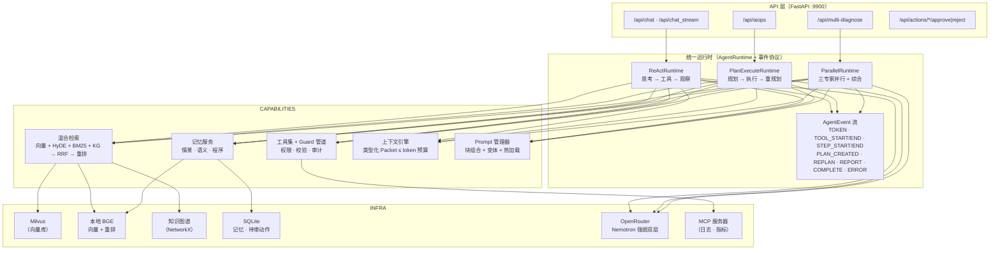

# SuperBizAgent — OnCall 智能运维 Agent

[English](README.md) | [简体中文](README.zh-CN.md)

> 基于 FastAPI + LangGraph 构建的生产形态 AIOps 助手：三种 Agent 范式跑在统一运行时上，混合检索带优雅降级阶梯，长期记忆 + 结构化规划 + 工具治理，三层评估体系。


## 核心亮点

- **统一 Agent 运行时** — ReAct / Plan-Execute / 并行专家三种范式实现同一 `AgentRuntime` 接口，产出同一套 10 类结构化事件流；SSE 契约只增不改，golden 快照测试钉死。
- **优雅降级的混合检索** — 向量（本地 BGE）+ HyDE + BM25 + 知识图谱四通道经 N 路 RRF 融合，再过本地交叉编码器重排；依赖故障时沿 6 级阶梯降级而非报错。
- **长期记忆** — 情景 / 语义 / 程序三类记忆落 SQLite（WAL、软删除），基于向量召回 + 加权打分公式，情景→语义巩固全程无需 LLM。
- **Token 预算上下文工程** — 类型化 Packet（记忆 / 图谱 / 文档 / 历史）按类别配额装配，溢出再分配，超限走 weak-LLM roll-up 压缩，硬预算封顶。
- **结构化规划与工具治理** — 计划是强类型 `PlanStep` / `StructuredPlan`，容错解析器永不抛异常；所有工具调用经过唯一 guard 管道（权限 → 参数校验 → 执行 → 审计），高风险动作必须人工审批，审批执行具备 exactly-once 语义。
- **Prompt 即基础设施** — 可组合提示词块（persona / rules / few-shot）支持热加载；请求头驱动的 A/B 变体（`X-Prompt-Variant`），按会话归因进 cost tracker，配套 A/B 回归评测器。
- **三层评估** — BFCL 式工具调用回放、GAIA 式分级任务匹配、LLM-as-judge（pairwise 胜率 + Cohen's κ），外加组件级回归套件（门禁未过以非零退出码上报）；用户负反馈自动回填负例数据集。

## 架构



所有会话状态经 LangGraph checkpointer 管理；API 层通过 golden 快照测试的翻译器把运行时事件映射为旧版 SSE dict——流式契约只增不改。

### 三种范式

| 运行时 | 模式 | 流式行为 |
|---|---|---|
| `ReActRuntime` | 思考 → 工具调用 → 观察循环（LangGraph `create_agent`） | 双通道 `stream_mode=["messages","updates"]`：token 边生成边推，节点提交即推工具起止 |
| `PlanExecuteRuntime` | plan → execute → replan StateGraph，结构化计划 | 总体 deadline 内真增量事件；超时输出部分报告 |
| `ParallelRuntime` | 日志 / 指标 / 知识三专家并发，综合器交叉验证 | 异步队列逐专家推送步骤事件；单专家失败隔离 |

### 永不崩溃的结构化规划

规划器产出强类型 `PlanStep`（`tool` / `args` / `depends_on` / `expected_evidence`）。`parse_plan()` 沿抢救阶梯递进——透传 → 围栏 JSON → 括号平衡提取 → 截断 JSON 抢救 → 行模式兜底——LLM 返回畸形时退化为普通字符串步骤而不是抛异常。执行器对绑定步骤直接经 guard 调用工具，未绑定步骤回退 mini-ReAct。

### 工具治理与人工确认

所有调用汇聚于 `guarded_call`：注册表权限检查 → JSON Schema 参数校验 → 执行 → 审计留痕。高风险工具绝不直接执行：guard 生成一个*待审动作*（SQLite 存储、带 TTL），流程暂停直到有人审批：

```
GET  /api/actions/pending
POST /api/actions/{action_id}/approve   # 原子认领 → exactly-once 执行
POST /api/actions/{action_id}/reject
```

### 混合检索与降级阶梯

四个通道——稠密向量（LLM 改写查询）、HyDE（假设答案嵌入）、BM25（jieba 分词）、知识图谱一跳子图——经倒数排名融合（k=60），再用本地交叉编码器针对原始查询重排。各通道独立故障隔离；健康检查失败时检索沿阶梯下行而不是挂掉：

```
L0  四通道混合 + 重排   →  L1  无重排 向量+BM25  →  L2  仅 BM25（改写查询）
→  L3  仅 BM25（原始查询）  →  L4  仅知识图谱      →  模板应答
```

Embedding（`BAAI/bge-large-zh-v1.5`，1024 维）与重排器（`BAAI/bge-reranker-base`）全部**本地运行**——零 API 成本、完全离线；只有查询改写和 HyDE 需要远端 LLM。

### 长期记忆与上下文工程

- 四类记忆按认知分层建模；`working` 留在 LangGraph checkpointer，其余持久化到 SQLite（WAL 模式 + 软删除）。
- 召回打分公式 `0.6·cosine + 0.25·importance + 0.15·exp(-λ·age_days)`，取重要性下限之上的 top-k。
- `consolidate()` 把聚类的情景记忆确定性合并为语义记忆——不经过 LLM。
- 上下文引擎把记忆 / 图谱 / 文档 / 历史 Packet 按类别配额装进硬 token 预算，剩余空间再分配，超限压缩时保留 `[PLAN]` / `[结论]` / `[未解]` 标记行。

### Prompt 作为版本化基础设施

模板声明可复用块（`prompts/blocks/*.yaml`，按意图标签的 few-shot）与命名变体；`render_composed()` 按 persona → 正文 → rules → few-shot 组装，mtime 热加载。发送 `X-Prompt-Variant: concise` 即路由到独立编译的 Agent 图；实际使用按会话归因进 cost tracker 并随 SSE `done` 事件回传，可直接对接 pairwise judge 对比。

## 快速开始

环境要求：**Python 3.11+**、Docker（Milvus）、[OpenRouter API Key](https://openrouter.ai/settings/keys)。

```bash
# 1. 安装
make install          # pip install -e .
# 或: uv sync --group dev

# 2. 配置
cp .env.example .env  # 设置 OPENROUTER_API_KEY（唯一必填项）

# 3. 一键启动：Milvus → MCP 服务 → API → 灌入文档
make init

# 4. 验证
make check            # curl http://localhost:9900/health
open http://localhost:9900/docs
```

首次建索引会下载约 1.3 GB 的本地 BGE 模型。更换文档或 embedding 模型后重建向量：

```bash
make reindex          # 重新灌入 aiops-docs/
make reindex-drop     # 删集合重建（更换 embedding 模型后必选）
```

前台开发模式：`make dev`（uvicorn --reload）。Windows：`start-windows.bat`。

### Docker 一键部署

不想装 Python 环境时，用 Docker Compose 一条命令拉起整套服务。依赖版本由入库的
`uv.lock` 经 `uv sync --frozen` 锁定，构建可复现：

```bash
cp .env.example .env  # 设置 OPENROUTER_API_KEY

docker compose up -d                    # 最小栈：应用本体（无 Milvus/MCP，自动降级）
docker compose --profile milvus up -d   # + Milvus 全栈（etcd/MinIO/standalone）
docker compose --profile mcp up -d      # + CLS(:8003)/Monitor(:8004) MCP 工具服务
```

打开 http://localhost:9900 即可使用；首次启动会在 `hf-cache` 卷中下载 BGE 模型
（约 1-2 GB，之后离线可用）。未启用的可选组件按降级阶梯处理，不阻塞启动。
数据落盘在命名卷：`app-data`（sqlite）、`app-uploads`（上传文档）、`app-logs`、`hf-cache`。

重建向量索引（容器内执行）：

```bash
docker compose exec app python scripts/reindex_vector_store.py
```

### Make 目标

| 目标 | 用途 |
|---|---|
| `make init` | 一键启动：Milvus → 服务 → 等健康 → 上传文档 |
| `make up` / `down` / `status` | Milvus standalone 的 Docker compose（含 Attu、MinIO） |
| `make start` / `stop` / `restart` | 后台 MCP 服务（:8003 日志、:8004 指标）+ FastAPI（:9900） |
| `make dev` / `run` | 前台 uvicorn（带 / 不带 reload） |
| `make upload` / `list-docs` | POST `aiops-docs/*.md` 入索引 / 列出已索引文件 |
| `make reindex` / `reindex-drop` | 重建向量集合（含 sanity 检索） |
| `make test` / `test-quick` / `coverage` | pytest（+ HTML 覆盖率） |
| `make lint` / `format` / `type-check` / `security` | ruff / mypy / bandit |

## API 概览

交互式文档见 `/docs`。关键端点：

| 端点 | 说明 |
|---|---|
| `POST /api/chat` | 非流式对话 |
| `POST /api/chat_stream` | SSE 对话：`content` / `tool_call` / `done` / `error` 帧 |
| `POST /api/chat/clear` · `GET /api/chat/session/{id}` | 清空 / 查看会话历史 |
| `POST /api/aiops` | SSE 自主诊断：`plan`（含 `plan_structured`）/ `step_complete` / `report` / `complete` |
| `GET|POST /api/actions/...` | 待审动作审批流 |
| `POST /api/multi-diagnose` | SSE 多 Agent 并行诊断 |
| `GET|DELETE /api/memory/{user_id}` | 查看 / 遗忘长期记忆 |
| `POST /api/feedback` | 用户反馈；负反馈自动回填评测负例集 |
| `GET /api/kg/stats|analyze|cascade|graph` · `POST /api/kg/extract|learn-incident` | 知识图谱查询与学习 |
| `POST /api/upload` · `/api/index_directory` | 文档摄取 |
| `GET /health` | 聚合健康状态（含降级服务清单） |

流式示例：

```bash
curl -N http://localhost:9900/api/chat_stream \
  -H 'Content-Type: application/json' \
  -H 'X-Prompt-Variant: concise' \
  -d '{"Id":"session-123","Question":"CPU 持续 95% 怎么排查？"}'
```

启用鉴权后（`AUTH_ENABLED=true` + `AUTH_API_KEY`），受保护路由需携带 `X-API-Key`。这是面向本地部署的静态共享密钥门禁——不是 IAM/RBAC。

## 配置

仅 `OPENROUTER_API_KEY` 必填。常用选项（完整列表见 `.env.example` / `app/config.py`）：

```bash
OPENROUTER_API_KEY=sk-or-v1-...                        # 必填
RAG_MODEL=nvidia/nemotron-3.5-lightning:free           # 强档模型（免费档）
LLM_BACKUP_MODEL=nvidia/nemotron-3-nano-30b-a3b:free   # 弱档 + 兜底
EMBEDDING_MODEL=BAAI/bge-large-zh-v1.5                 # 本地向量（1024 维）
RERANK_ENABLED=true                                    # 本地交叉编码器重排
MILVUS_HOST=localhost
MILVUS_PORT=19530
MEMORY_ENABLED=true                                    # 长期记忆总开关
CONTEXT_TOKEN_BUDGET=6000                              # 上下文引擎预算
AUTH_ENABLED=false                                     # X-API-Key 中间件
```

## 评估

```bash
python -m app.eval.ci_runner --mode smoke        # 快速路由 sanity（CI 默认）
python -m app.eval.ci_runner --mode gating       # PR 门禁
python -m app.eval.ci_runner --mode regression   # 全量 55 用例组件指标
python -m app.eval.ci_runner --suite bfcl        # 离线工具调用 trace 回放
python -m app.eval.ci_runner --suite gaia        # 离线分级任务匹配
python -m app.eval.ci_runner --mode full         # e2e RAGAS（产生 LLM 费用）

python -m app.eval.prompt_regression \
  --baseline prompts/ --candidate prompts_v2/    # Prompt A/B 回归
```

评估层次：**组件级**（路由准确率、上下文召回 / 精度、KG 覆盖率）、**任务级**（GAIA 式 exact/partial/wrong 证据匹配）、**工具级**（BFCL 式类型敏感参数匹配，跑在审计 trace 上）、**裁判级**（faithfulness / relevancy 1–5 分、pairwise 胜率、Cohen's κ）。金标数据集带 version + SHA-256 信封；注册表拒绝无版本文件。注意：LLM 路由类指标即使 temperature=0 在多次运行间也不确定——单次波动 ±20pp 以内视为噪声。

CI 如实说明：GitHub 托管 runner 没有 Milvus / 本地模型全栈，评测作业在那里走降级阶梯，指标仅作信息参考（报告发布到 job summary）而非门禁。权威门禁是 `ci_runner` 在本地全栈或自托管 runner 上的运行——门禁未过即非零退出码。

## 项目结构

```
app/
├── api/            # FastAPI 路由 + SSE 事件翻译器（golden 快照测试）
├── agent/
│   ├── runtime/    # AgentRuntime ABC、三种范式、事件协议、工具集
│   ├── aiops/      # planner / executor / replanner（结构化计划）
│   └── multi/      # coordinator + 三专家
├── services/       # RRF 融合、图检索、记忆、会话存储、
│                   # 降级阶梯、待审动作、服务门面
├── core/           # 分层 LLM 工厂、Prompt 管理器、上下文引擎、
│                   # 成本追踪、熔断 / 健康注册表
├── tools/          # @tools、角色过滤器、guard 管道、工具注册表
├── eval/           # ci_runner、bfcl/gaia/judge 套件、数据集注册表
└── models/         # Pydantic 请求 / 响应 / 计划模型
prompts/            # YAML 模板 + blocks/（persona/rules/few_shot）
mcp_servers/        # 旁挂 MCP 服务：CLS 日志（:8003）、监控（:8004）
static/             # 极简 Web UI（含 vis-network 图谱可视化）
eval/datasets/      # 版本化金标数据集
scripts/            # reindex_vector_store.py 等
tests/              # 46 个测试文件、585 个测试
```

## 设计取舍（诚实声明）

明确的范围决策：静态密钥鉴权而非 IAM；SQLite + NetworkX 而非 Redis/Neo4j（对应单进程部署）；记忆召回为暴力余弦扫描（作品集规模够用，未建 ANN 索引）；巩固合并不做 LLM 合成；working 记忆留在 checkpointer 而非 SQLite。离线 `--suite bfcl/gaia/judge` 先于其金标数据集交付——套件可运行，数据集就位前优雅报告 SKIPPED。

## 许可证

[MIT](LICENSE)
